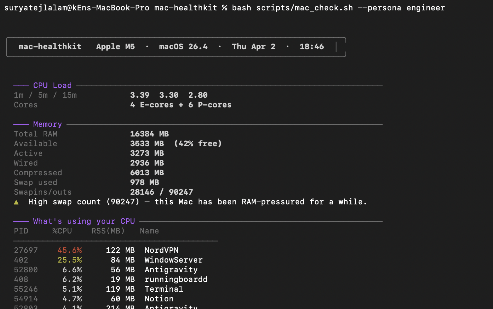
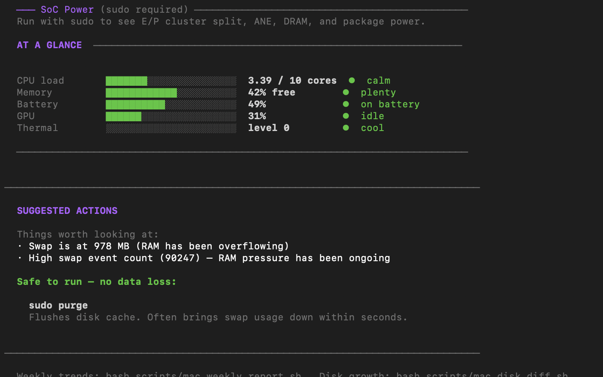
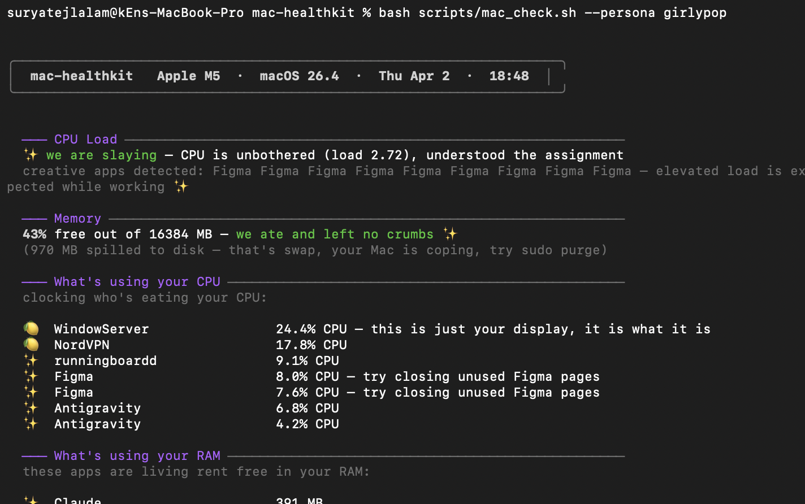
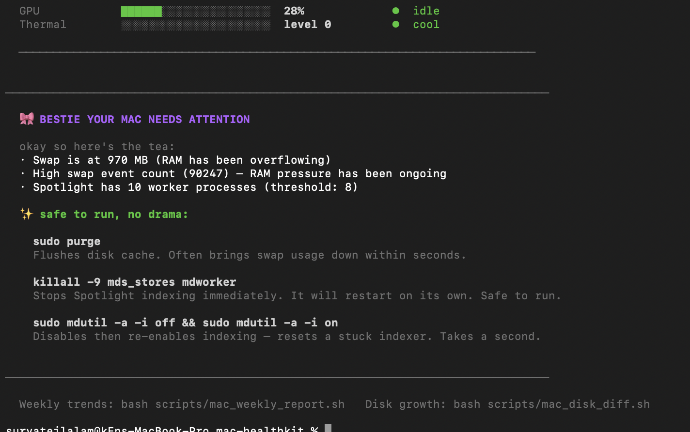
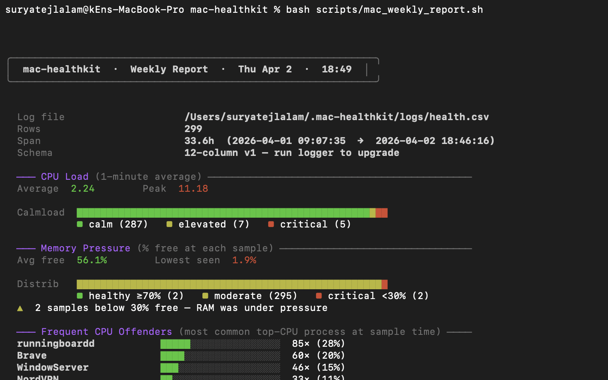

# mac-healthkit

> A free, open-source Mac health toolkit for Apple Silicon — no subscriptions, no cloud, no dependencies.

Does what **iStatMenus**, **CleanMyMac**, and **Sensei** charge $10–$40/year for, using only tools your Mac already ships with.





---

## What it does

- **On-demand health check** — CPU load, memory pressure, swap, GPU, thermal, battery, top processes, known app culprits, and suggested fixes in one report
- **Three output modes** — raw engineer data, plain English, or Girly Pop 🎀 (creative-tool-aware, zero jargon)
- **Background logger** — silently appends one CSV row every 5 minutes via launchd
- **Weekly trend report** — reads that log and shows how your Mac has been behaving over time
- **Disk growth check** — diffs `~/Library` against last week, flags what's eating space, suggests fix commands
- **Native notifications** — alerts on threshold breaches without any notification library or menu bar app
- **Interactive menu** — a guided questionnaire so you don't have to memorise any flags

---

## Requirements

- Apple Silicon (M1 / M2 / M3 / M4 / M5)
- macOS 14 Sonoma, macOS 15 Sequoia, or macOS 26 Tahoe
- Nothing else — no Homebrew, no Python, no npm

> **Intel Macs:** most scripts will run, but metrics are tuned for Apple Silicon and results are untested on Intel.

---

## Install

```bash
git clone https://github.com/lsuryatej/mac-healthkit.git
cd mac-healthkit
bash install/install.sh
```

The installer:
- Makes all scripts executable
- Copies two launchd plists to `~/Library/LaunchAgents/`
- Loads the background logger (every 5 min) and watcher (every 10 min)
- Creates `~/.mac-healthkit/logs/` and `~/.mac-healthkit/snapshots/`

---

## Quick start

The fastest way in is the interactive menu:

```bash
bash scripts/mac_menu.sh
```

It detects your current setup (power source, display count, whether you just woke the machine), asks how you want to see output, runs the check, and offers follow-up actions — no flags needed.

---

## Running scripts directly

```bash
# Full health check (picks up a persona flag)
bash scripts/mac_check.sh
bash scripts/mac_check.sh --persona engineer
bash scripts/mac_check.sh --persona plaintext
bash scripts/mac_check.sh --persona girlypop

# Persona shortcuts
bash personas/engineer.sh
bash personas/plaintext.sh
bash personas/girlypop.sh

# Weekly trend report (requires at least a few hours of logged data)
bash scripts/mac_weekly_report.sh

# Disk growth diff
bash scripts/mac_disk_diff.sh
```

---

## The three output modes

### Engineer
Raw numbers, PIDs, exact MB, process paths. Status labels like `▶ nominal` / `▶ CRITICAL`. Kill commands ready to copy-paste. Assumes you know what you're looking at.

### Plain English
Traffic-light emojis (🟢 🟡 🔴), plain sentences, rounded numbers. "Your Mac is working very hard right now" instead of load averages. Suggests specific actions without assuming Terminal fluency.

### Girly Pop 🎀




Built for designers and creative professionals. Detects if Photoshop, After Effects, Figma, Premiere, or Lightroom is running and tailors the output to those tools specifically. Friendly slang, emoji indicators, zero jargon. High RAM? *"bestie your Mac is holding onto everything like it has abandonment issues."*

---

## Context-aware adjustments

Before running, the toolkit reads your current setup and adjusts thresholds accordingly:

| Context | What changes |
|---|---|
| On battery | Battery warnings trigger earlier |
| Multiple external displays | GPU "active" threshold scales up (each display costs GPU budget) |
| Just woken from sleep | A notice appears; metrics may be temporarily spiked |
| Video call active (Zoom / Teams / Meet) | Noted in the header so you know why CPU is elevated |

---

## What the health check covers

| Section | What's measured |
|---|---|
| CPU | Load averages (1m / 5m / 15m), top CPU process |
| Memory | Free %, swap used, swap events, compressed pages, top memory process |
| GPU | Utilisation % via ioreg, context-adjusted thresholds |
| Thermal | kern.thermalevel — whether the machine is throttling |
| Battery | Charge %, battery health %, charge cycle awareness |
| Processes | Energy impact ranking via `top`, background agents |
| Known culprits | Per-app detection (see table below) |
| Suggested actions | Only shown when something actually needs attention |

### Known culprit detection

| App / Process | What's detected | Suggested fix |
|---|---|---|
| iWork (Pages / Numbers / Keynote) | RSS > 1.5 GB | Quit and reopen |
| Notion GPU Helper | > 10% CPU | `killall 'Notion Helper (GPU)'` |
| iCloud `bird` | > 20% CPU | `killall bird` |
| Spotlight (`mds_stores`) | > 8 indexing processes | `sudo mdutil -a -i off && on` |
| WebKit tabs | Any WebContent > 500 MB | Close tabs |
| Brave renderer flood | > 8 renderer processes | Close tabs |
| Docker | Combined > 10% CPU | `docker stats --no-stream` |
| Python / Jupyter | Combined > 20% CPU | Check running notebooks |
| Node.js / Next.js dev server | Combined > 15% CPU | Check dev servers |
| VPN client | > 300 MB RAM | Restart VPN client |

---

## Background logger + weekly report

```
launchd (every 5 min)
  └─▶ mac_logger.sh
        └─▶ appends one row to ~/.mac-healthkit/logs/health.csv

You (any time)
  └─▶ mac_weekly_report.sh
        └─▶ reads health.csv → trend analysis
```



The weekly report shows:
- Average and peak load averages for the period
- Memory pressure distribution (% of time healthy / warning / critical)
- Top CPU offenders by frequency
- Worst memory events with timestamps
- Swap event count, GPU and thermal history (if logged)

Log rotation kicks in at 50 MB — `health.csv` is moved to `health.csv.1` and a fresh file starts.

---

## Native notifications (no app required)

`mac_watch.sh` runs every 10 minutes via launchd and fires macOS notifications when:

| Condition | Alert |
|---|---|
| Load avg (1m) > 6 | Top process name |
| Free memory < 15% | Top memory process |
| Any process > 3 GB RAM | Process name + kill command |
| Any WebKit tab > 800 MB | PID |

The same alert won't fire again for 30 minutes (debounced via `~/.mac-healthkit/watch_state.txt`).

---

## Comparison with paid tools

| Feature | mac-healthkit | iStatMenus ($10/yr) | CleanMyMac ($40/yr) | Sensei ($29/yr) |
|---|---|---|---|---|
| CPU / memory / GPU stats | ✅ | ✅ | ✅ | ✅ |
| Named process breakdown | ✅ | ✅ | ⚠️ basic | ✅ |
| Known app culprit detection | ✅ | ❌ | ❌ | ❌ |
| Background CSV logging | ✅ | ❌ | ❌ | ❌ |
| Weekly trend report | ✅ | ❌ | ❌ | ❌ |
| Disk growth diff | ✅ | ❌ | ✅ | ⚠️ basic |
| Native notifications | ✅ | ✅ | ❌ | ❌ |
| Multiple output personas | ✅ | ❌ | ❌ | ❌ |
| Interactive menu | ✅ | ❌ | ❌ | ❌ |
| Zero install / no dependencies | ✅ | ❌ | ❌ | ❌ |
| Open source | ✅ GPL-3.0 | ❌ | ❌ | ❌ |
| Price | **Free** | $10/yr | $40/yr | $29/yr |

> Paid tool comparisons are based on publicly documented features as of early 2026. If anything here is inaccurate, open an issue.

---

## Uninstall

```bash
bash install/install.sh --uninstall
```

Unloads the launchd agents and removes the plists. Your log data is left untouched. To remove everything:

```bash
rm -rf ~/.mac-healthkit
```

---

## Project layout

```
mac-healthkit/
├── scripts/
│   ├── mac_check.sh          # on-demand health diagnostic
│   ├── mac_logger.sh         # background CSV logger (runs via launchd)
│   ├── mac_watch.sh          # threshold watcher + notifications (runs via launchd)
│   ├── mac_weekly_report.sh  # trend report from logged data
│   ├── mac_disk_diff.sh      # ~/Library growth diff
│   └── mac_menu.sh           # interactive menu
├── personas/
│   ├── engineer.sh           # shortcut → mac_check.sh --persona engineer
│   ├── plaintext.sh          # shortcut → mac_check.sh --persona plaintext
│   └── girlypop.sh           # shortcut → mac_check.sh --persona girlypop
└── install/
    ├── install.sh
    ├── com.machealthkit.logger.plist
    └── com.machealthkit.watch.plist
```

---

## License

GPL-3.0. Free to use, modify, and redistribute. You may **not** incorporate this into a proprietary or paid product without releasing your modifications under the same license. See [LICENSE](LICENSE) for the full text.
